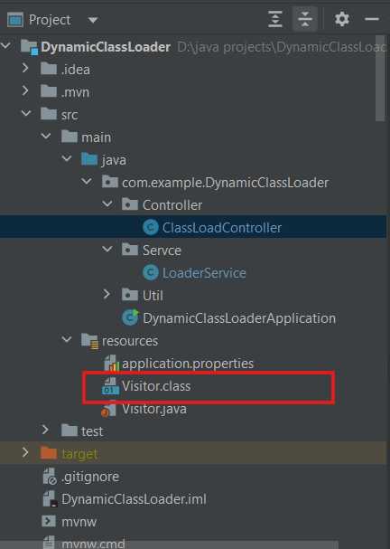
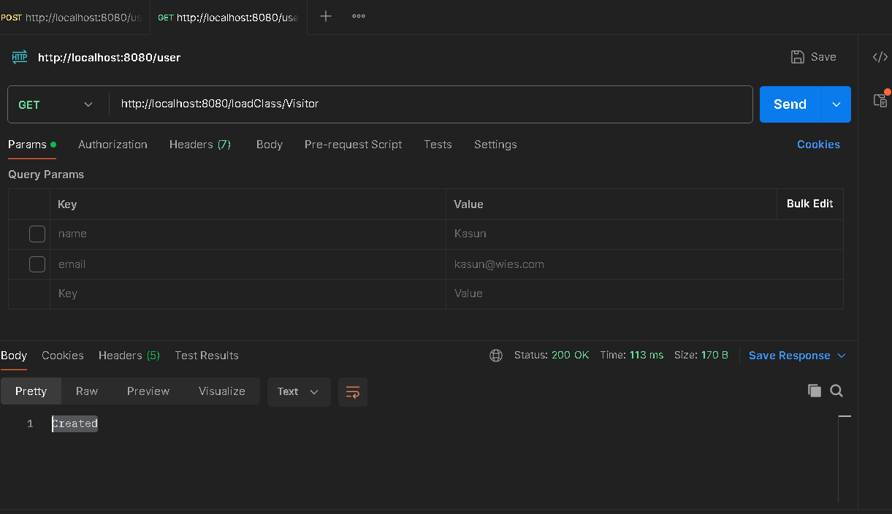
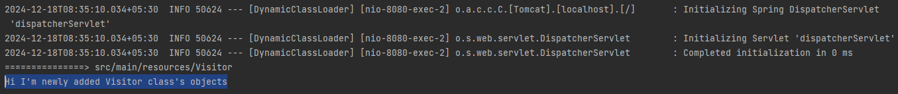

# Simple Spring Boot Application with Dynamic Class Load

This project demonstrates how to load external class into your main application using Java's URLClassLoader. This approach is particularly useful for designing plugins or loading new components/classes without restarting the main application.

## Table of Contents

- [Technologies Used](#technologies-used)
- [Program Specification](#program-specification)
- [Input](#input)
- [Output](#output)
- [Setup Instructions](#setup-instructions)
- [How to Run the Application](#how-to-run-the-application)
- [License](#license)

## Technologies Used

<table>
    <tr>
        <td align="center">
            <a href="https://www.java.com" target="_blank" rel="noreferrer"> 
                 
            </a><br> Java 21
        </td>
        <td align="center">
            <a href="https://spring.io/projects/spring-boot" target="_blank" rel="noreferrer"> 
                 
            </a><br> Spring Boot 3.4.0
        </td>
        <td align="center">
            <a href="https://maven.apache.org/" target="_blank" rel="noreferrer"> 
                 
            </a><br> Maven 4.0.0
        </td>
    </tr>
</table>

## Program Specification

- **Input**: Add java class file into specific folder.
- **Process**: Trigger API endpoint by providing class name as path variable.
- **Output**: In newly added class, method will be invoke and SOP will be print on the terminal.

## Input

- Step 1
    Run the Spring Boot application. You can find the run instructions below.

- Step 2
    Compile the Java file you wish to load into the program to create a class file. Place this class file in the resources folder (this is the default location I have chosen, but you can change both the location and class name as needed).

   

- Step 3
    Trigger the API endpoint by using your file name as a path variable. For example, use the following URL: http://localhost:8080/loadClass/Visitor 



## Output

- You can see the created message in Postman after successfully invoking the method, as shown in the image above.
- Bellow message on the terminal.



## Setup Instructions

1. **Clone the Repository**:
   ```bash
   git clone https://github.com/khasanka/Dynamic-Class-Loader.git
   cd DynamicClassLoader
   ```
   
2. **Build the Project**:
   
   Make sure you have Maven installed. Run the following command to build the project.
   
   ```bash
   mvn clean install
   ```

## How to Run the Application

**Run the application using your IDE or by executing the following command in your terminal.**

```bash
   mvn spring-boot:run
```

## License

  **This project is licensed under the MIT License. Feel free to use, modify, and distribute this application as per the terms of the license.**


